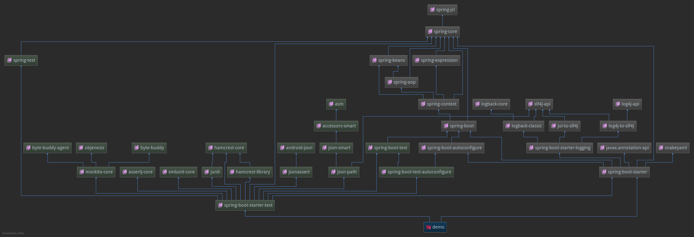

### 依赖分析
springboot项目从官网指引的步骤生成的项目，执行`mvn dependency:tree`，输出如下：
```bash
com.XXX:demo:jar:0.0.1-SNAPSHOT
+- org.springframework.boot:spring-boot-starter:jar:2.1.2.RELEASE:compile
|  +- org.springframework.boot:spring-boot:jar:2.1.2.RELEASE:compile
|  |  \- org.springframework:spring-context:jar:5.1.4.RELEASE:compile
|  |     +- org.springframework:spring-aop:jar:5.1.4.RELEASE:compile
|  |     +- org.springframework:spring-beans:jar:5.1.4.RELEASE:compile
|  |     \- org.springframework:spring-expression:jar:5.1.4.RELEASE:compile
|  +- org.springframework.boot:spring-boot-autoconfigure:jar:2.1.2.RELEASE:compile
|  +- org.springframework.boot:spring-boot-starter-logging:jar:2.1.2.RELEASE:compile
|  |  +- ch.qos.logback:logback-classic:jar:1.2.3:compile
|  |  |  \- ch.qos.logback:logback-core:jar:1.2.3:compile
|  |  +- org.apache.logging.log4j:log4j-to-slf4j:jar:2.11.1:compile
|  |  |  \- org.apache.logging.log4j:log4j-api:jar:2.11.1:compile
|  |  \- org.slf4j:jul-to-slf4j:jar:1.7.25:compile
|  +- javax.annotation:javax.annotation-api:jar:1.3.2:compile
|  +- org.springframework:spring-core:jar:5.1.4.RELEASE:compile
|  |  \- org.springframework:spring-jcl:jar:5.1.4.RELEASE:compile
|  \- org.yaml:snakeyaml:jar:1.23:runtime
\- org.springframework.boot:spring-boot-starter-test:jar:2.1.2.RELEASE:test
   +- org.springframework.boot:spring-boot-test:jar:2.1.2.RELEASE:test
   +- org.springframework.boot:spring-boot-test-autoconfigure:jar:2.1.2.RELEASE:test
   +- com.jayway.jsonpath:json-path:jar:2.4.0:test
   |  +- net.minidev:json-smart:jar:2.3:test
   |  |  \- net.minidev:accessors-smart:jar:1.2:test
   |  |     \- org.ow2.asm:asm:jar:5.0.4:test
   |  \- org.slf4j:slf4j-api:jar:1.7.25:compile
   +- junit:junit:jar:4.12:test
   +- org.assertj:assertj-core:jar:3.11.1:test
   +- org.mockito:mockito-core:jar:2.23.4:test
   |  +- net.bytebuddy:byte-buddy:jar:1.9.7:test
   |  +- net.bytebuddy:byte-buddy-agent:jar:1.9.7:test
   |  \- org.objenesis:objenesis:jar:2.6:test
   +- org.hamcrest:hamcrest-core:jar:1.3:test
   +- org.hamcrest:hamcrest-library:jar:1.3:test
   +- org.skyscreamer:jsonassert:jar:1.5.0:test
   |  \- com.vaadin.external.google:android-json:jar:0.0.20131108.vaadin1:test
   +- org.springframework:spring-test:jar:5.1.4.RELEASE:test
   \- org.xmlunit:xmlunit-core:jar:2.6.2:test

```

这个直观一点：


###