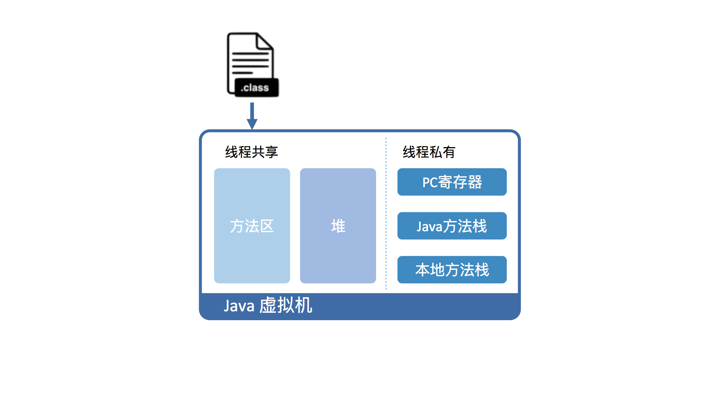

## Java运行方式
- 在JRE下(JRE 仅包含运行 Java 程序的必需组件，包括 Java 虚拟机以及 Java 核心类库等。JDK包含JRE，附带开发、诊断工具。)
- C++无需额外的运行环境。直接编译成 CPU 所能理解的机器码。

## 为什么 Java 要在虚拟机里运行？
- Java语法复杂，抽象程度高。直接在硬件上运行不现实。所以呢，在运行 Java 前转换。
- 设计一个虚拟机，通过编译器将Java转换成该虚拟机所能识别的指令序列，也称 Java 字节码。因为 Java 字节码指令的操作码（opcode）被固定为一个字节。
- 不同的是，比起C++，Java的编译结果相对精简一些。因为Java虚拟机相对于物理机而言，抽象程度更高。
- Java 虚拟机可以由硬件实现
- 各个现有平台（如 Windows_x64、Linux_aarch64）上软件实现。这么做的意义在于，一旦一个程序被转换成 Java 字节码，
可以在不同平台上的虚拟机实现里运行。这也就是我们经常说的“一次编写，到处运行”。
- 虚拟机的另外一个好处是托管环境（Managed Runtime）。这个托管环境能够代替我们处理一些代码中冗长而且容易出错的部分。
其中最广为人知的 自动内存管理 垃圾回收.除此之外，数组越界、动态类型、安全权限等动态检测，使免于书写无关业务逻辑代码。

## Java 虚拟机具体是怎样运行 Java 字节码的？
1. 虚拟机视角，首先java文件编译的class文件加载到Java虚拟机中
2. 加载后的Java类会被存放于方法区（Method Area）中
3. 实际运行时，虚拟机会执行方法区内的代码。
4. 运行过程调用进入一个Java方法，Java虚拟机在当前线程的Java方法栈中生成一个栈帧，存放局部变量以及字节码的操作数。
这个栈帧的大小是提前计算好的，而且 Java 虚拟机不要求栈帧在内存空间里连续分布。
5. 当退出当前执行的方法时，不管是正常返回还是异常返回，Java 虚拟机均会弹出当前线程的当前栈帧，并将之舍弃。

- 和X86的段式内存管理类似，Java虚拟机也在内存中划分出堆和栈来存储运行时数据。
- 不同的是，Java虚拟机将栈细分为面向Java方法的Java方法栈，面向本地方法（用 C++ 写的 native 方法）的本地方法栈，
以及存放各个线程执行位置的PC寄存器。

  

- 从硬件视角来看，Java 字节码无法直接执行。因此，Java 虚拟机需要将字节码翻译成机器码。

1. HotSpot里第一种是解释执行，逐条将字节码翻译成机器码并执行. ***无需等待编译***
2. 第二种是即时编译（Just-In-Time compilation，JIT），
将一个方法中包含的所有字节码编译成机器码后再执行。 ***实际运行速度更快***

- HotSpot 默认采用混合模式，综合了解释执行和即时编译两者的优点。
先解释执行字节码，而后将其中反复执行的热点代码，以方法为单位进行即时编译。

## Java 虚拟机的运行效率究竟是怎么样的？

- 即时编译建立在程序符合二八定律的假设上，也就是百分之二十的代码占据了百分之八十的计算资源。
- 对于占据大部分的不常用的代码，我们无需耗费时间将其编译成机器码，而是采取解释执行的方式运行；
另一方面，对于仅占据小部分的热点代码，我们则可以将其编译成机器码，以达到理想的运行速度。
- 为了满足不同用户场景的需要，HotSpot 内置了多个即时编译器：C1、C2 和 Graal。
- C1 又叫做 Client 编译器，面向的是对启动性能有要求的客户端 GUI 程序，采用的优化手段相对简单，因此编译时间较短。
- C2 又叫做 Server 编译器，面向的是对峰值性能有要求的服务器端程序，采用的优化手段相对复杂，因此编译时间较长，但同时生成代码的执行效率较高。
- Java 7 开始，HotSpot 默认采用分层编译的方式：热点方法首先会被 C1 编译，而后热点方法中的热点会进一步被 C2 编译。
- 为了不干扰应用的正常运行，HotSpot 的即时编译是放在额外的编译线程中进行的,根据 CPU 的数量设置编译线程的数目，
并且按 1:2 的比例配置给 C1 及 C2 编译器。
- 在计算资源充足的情况下，字节码的解释执行和即时编译可同时进行。编译完成后的机器码会在下次调用该方法时启用，以替换原本的解释执行。

## Java 虚拟机的 boolean 类型
- 在 Java 语言规范中，boolean 类型的值只有符号“true”和“false”。显然，这两个符号是不能被虚拟机直接使用的。
- 在 Java 虚拟机规范中，boolean 类型则被映射成 int 类型。具体来说，“true”被映射为整数 1，而“false”被映射为整数 0。
这个编码规则约束了 Java 字节码的具体实现。

## Java 的基本类型

- byte、short、int、long、float 以及 double 的值域依次扩大，而且前面的值域被后面的值域所包含。
从前面的基本类型转换至后面的基本类型，无需强制转换。尽管他们的默认值看起来不一样，但在内存中都是 0。
- 在这些基本类型中，boolean 和 char 是唯二的无符号类型。在不考虑违反规范的情况下，boolean 类型的取值范围是 0 或者 1。
char 类型的取值范围则是 [0, 65535]。通常我们可以认定 char 类型的值为非负数。这种特性十分有用，比如说作为数组索引等。